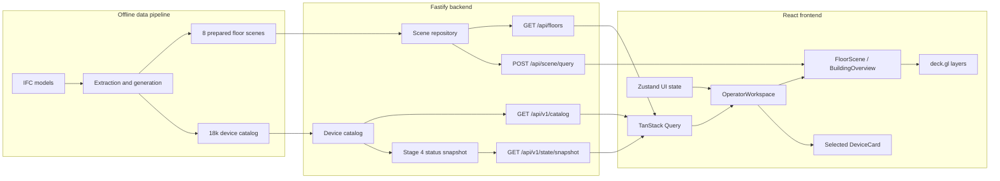

# Architecture

Незакрытые межэтапные архитектурные риски и критерии их закрытия ведутся отдельно в [`architecture-todo.md`](architecture-todo.md).

## System boundaries



The browser never receives raw IFC or protocol-specific frames and never talks directly to physical-system gateways.

## State ownership

| State class | Canonical examples | Frontend owner | Update pattern |
| --- | --- | --- | --- |
| Plan scene | walls, doors, labels, floor bounds | scene query cache / deck.gl layers | viewport and zoom query |
| Stable metadata | device name, type, protocol, floor, position, capabilities | TanStack Query catalog cache | versioned snapshot/invalidation |
| Hot operational state | telemetry, status, connection, alarms, command records | indexed external store keyed by ID | ordered batched deltas or full replacement |
| UI-only state | selected floor/device, filters, view state, panels, command draft | Zustand | local user interaction |
| Renderer state | stable instance order, icon/color/size attributes, dirty indices | WebGL subsystem | controlled frame cadence |

Transport arrays are indexed once on ingestion. A telemetry event must not recreate the complete device metadata array or trigger a React render for every device.

## Domain relationships

```text
Building 1 -> many Floors
Floor    1 -> many DeviceMetadata
Device   1 -> latest DeviceTelemetry
Device   1 -> many Alarms
Device   1 -> many CommandRecords

DeviceMetadata.binding.dataOrigin
        -> ifc | derived | synthetic
```

`roomId` is nullable. Position is in floor-local Cartesian metres and is stable for a catalog version.

## REST contract

All new operational endpoints use `/api/v1`. The Stage 0 `/api/scene/query` endpoint remains unchanged until a separately approved migration.

| Method and path | Purpose | Contract |
| --- | --- | --- |
| `GET /api/v1/catalog?buildingId&floorIds*` | Cacheable stable building/floor/device metadata | `CatalogQuery` -> `CatalogResponse` |
| `GET /api/v1/state/snapshot?buildingId&floorIds*` | Authoritative hot-state replacement and stream cursor | `StateSnapshotQuery` -> `StateSnapshot` |
| `POST /api/v1/alarms/:alarmId/acknowledge` | Idempotent alarm acknowledgement | `AcknowledgeAlarmRequest` -> `AcknowledgeAlarmResponse` |
| `POST /api/v1/commands` | Idempotent simulated command creation | `CreateCommandRequest` -> `CreateCommandResponse` |
| `GET /api/v1/commands/:commandId` | Command status fallback when realtime is unavailable | `CommandResponse` |
| `GET /api/v1/realtime` with WebSocket upgrade | Ordered realtime events | realtime client/server message unions |

Successful catalog responses expose `catalogVersion` and should use an HTTP `ETag`. Errors use `ApiError`. Authentication is intentionally out of scope; `requestedBy` and `acknowledgedBy` are mock actor IDs, not trusted identity claims.

## Snapshot and realtime lifecycle

```text
connect WebSocket
  -> subscribe(buildingId, optional floorIds)
  <- hello(streamId, latestSequence, retentionStartSequence)
  -> GET state/snapshot
  <- snapshot(streamId, sequence, full hot state)
  -> resume(streamId, afterSequence = snapshot.sequence)
  <- event.batch with contiguous sequences

reconnect
  -> resume(last streamId, last applied sequence)
  <- replayed event.batch
     or resync.required -> replace from HTTP snapshot -> resume
```

The client applies a batch only in ascending contiguous sequence order. Duplicates at or below the applied cursor are ignored. A gap is not guessed over. Telemetry updates also carry a per-device revision so late values for one device cannot overwrite newer state.

The HTTP snapshot is authoritative and replaces telemetry, alarm, command, stream ID, and cursor atomically. Stable metadata is not repeated in the hot snapshot.

## Alarm lifecycle

```text
active -> acknowledged -> resolved
active ----------------> resolved
```

Acknowledged alarms require `acknowledgedAt` and `acknowledgedBy`; resolved alarms require `resolvedAt`. An upsert event carries the complete alarm record because alarm volume is much lower than telemetry volume and lifecycle correctness is more important than field-level compression.

## Command lifecycle

```text
UI only: draft
transport: pending -> accepted -> executed
                   -> failed
                   -> timedOut
```

`clientRequestId` is the idempotency key. The command intent is immutable after submission. Terminal records retain failure details or the telemetry revision associated with execution when available. Desired state, backend lifecycle, and actual telemetry remain separate.

## Contract sources

- Runtime source of truth: `src/shared/domain-contracts.ts`, `api-contracts.ts`, and `realtime-contracts.ts`.
- Backend-independent artifacts: generated JSON Schema in `contracts/`.
- `npm run contracts:check` fails when committed generated schemas are stale.
- ADR-0004 defines state separation; ADR-0005 defines realtime recovery.

## Stage 4 implementation boundary

Stage 4 serves eight scenes, renders floor/building modes and exposes a deterministic read-only status snapshot. TanStack Query owns server documents; Zustand owns shared UI state. The snapshot is indexed for rendering without adding status to stable metadata.

Stage 4 intentionally does not implement WebSocket transport or the indexed external hot store shown in the target architecture. Those belong to Stage 5. The static snapshot uses the final contract shape so the data source can change without rewriting scene/catalog boundaries.
