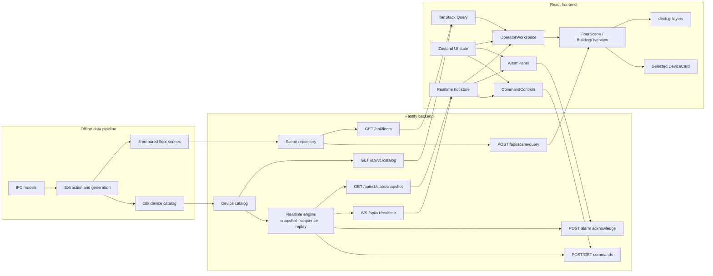

# Architecture

Незакрытые межэтапные архитектурные риски и критерии их закрытия ведутся отдельно в [`architecture-todo.md`](architecture-todo.md).

- Актуально на: 2026-08-10
- Текущий статус: объединённый Stage 8–9 завершён и принят; Stage 10 не начат.

## System boundaries



The browser never receives raw IFC or protocol-specific frames and never talks directly to physical-system gateways.

## State ownership

| State class | Canonical examples | Frontend owner | Update pattern |
| --- | --- | --- | --- |
| Plan scene | walls, doors, labels, floor bounds | scene query cache / deck.gl layers | viewport and zoom query |
| Stable metadata | device name, type, protocol, floor, position, capabilities | TanStack Query catalog cache | versioned snapshot/invalidation |
| Hot operational state | telemetry, status, connection, alarms, command records | indexed external store keyed by ID | ordered batched deltas or full replacement |
| UI-only state | selected floor/device, filters, view state, panels, command draft | Zustand | local user interaction |
| Renderer state | stable instance order, icon/color/size attributes, dirty indices | WebGL subsystem | controlled frame cadence |

Transport arrays are indexed once on ingestion. A telemetry event must not recreate the complete device metadata array or trigger a React render for every device.

## Domain relationships

```text
Building 1 -> many Floors
Floor    1 -> many DeviceMetadata
Device   1 -> latest DeviceTelemetry
Device   1 -> many Alarms
Device   1 -> many CommandRecords

DeviceMetadata.binding.dataOrigin
        -> ifc | derived | synthetic
```

`roomId` is nullable. Position is in floor-local Cartesian metres and is stable for a catalog version.

## REST contract

All new operational endpoints use `/api/v1`. The Stage 0 `/api/scene/query` endpoint remains unchanged until a separately approved migration.

| Method and path | Purpose | Contract |
| --- | --- | --- |
| `GET /api/v1/catalog?buildingId&floorIds*` | Cacheable stable building/floor/device metadata | `CatalogQuery` -> `CatalogResponse` |
| `GET /api/v1/state/snapshot?buildingId&floorIds*` | Authoritative hot-state replacement and stream cursor | `StateSnapshotQuery` -> `StateSnapshot` |
| `POST /api/v1/alarms/:alarmId/acknowledge` | Idempotent alarm acknowledgement | `AcknowledgeAlarmRequest` -> `AcknowledgeAlarmResponse` |
| `POST /api/v1/commands` | Idempotent simulated command creation | `CreateCommandRequest` -> `CreateCommandResponse` |
| `GET /api/v1/commands/:commandId` | Command status fallback when realtime is unavailable | `CommandResponse` |
| `GET /api/v1/realtime` with WebSocket upgrade | Ordered realtime events | realtime client/server message unions |

Successful catalog responses expose `catalogVersion` and should use an HTTP `ETag`. Errors use `ApiError`. Authentication is intentionally out of scope; `requestedBy` and `acknowledgedBy` are mock actor IDs, not trusted identity claims.

## Snapshot and realtime lifecycle

```text
GET state/snapshot(buildingId)
  <- snapshot(streamId, sequence, full hot state)
connect WebSocket
  -> resume(streamId, afterSequence = snapshot.sequence)
  <- hello(streamId, latestSequence, retentionStartSequence)
  <- event.batch with contiguous sequences

reconnect
  -> resume(last streamId, last applied sequence)
  <- replayed event.batch
     or resync.required -> replace from HTTP snapshot -> resume
```

The client applies a batch only in ascending contiguous sequence order. Duplicates at or below the applied cursor are ignored. A gap is not guessed over. Telemetry updates also carry a per-device revision so late values for one device cannot overwrite newer state.

The HTTP snapshot is authoritative and replaces telemetry, alarm, command, stream ID, and cursor atomically. Stable metadata is not repeated in the hot snapshot.

## Alarm lifecycle

```text
active -> acknowledged -> resolved
active ----------------> resolved
```

Acknowledged alarms require `acknowledgedAt` and `acknowledgedBy`; resolved alarms require `resolvedAt`. An upsert event carries the complete alarm record because alarm volume is much lower than telemetry volume and lifecycle correctness is more important than field-level compression.

## Command lifecycle

```text
UI only: draft
transport: pending -> accepted -> executed
                   -> failed
                   -> timedOut
```

`clientRequestId` is the idempotency key. The command intent is immutable after submission. Terminal records retain failure details or the telemetry revision associated with execution when available. Desired state, backend lifecycle, and actual telemetry remain separate.

## Contract sources

- Runtime source of truth: `src/shared/scene-contracts.ts`, `domain-contracts.ts`, `api-contracts.ts`, and `realtime-contracts.ts`.
- Backend-independent artifacts: generated JSON Schema in `contracts/`.
- `npm run contracts:check` fails when committed generated schemas are stale.
- ADR-0004 defines state separation; ADR-0005 defines realtime recovery.

## Stage 5 implementation boundary

Stage 5 preserves the eight scene/catalog flows and replaces the read-only status fixture with an authoritative in-memory engine, building-scoped ordered WebSocket stream, bounded replay and HTTP resync. TanStack Query owns stable/cacheable server documents; direct HTTP bootstrap/resync feeds the external hot store without a second query-cache copy. Zustand owns shared UI state; the hot store owns indexed operational state and cursor.

Selective subscriptions isolate update domains: toolbar observes connection/cursor, `DeviceCard` observes one telemetry record, and renderers observe status versions/dirty IDs. Value-only telemetry does not rebuild device layers. Status-only changes use deck.gl dirty ranges unless they change normal/priority layer membership.

Stage 4 post-acceptance geometry hardening adds one generated convex-hull `floor-shell` per prepared floor. It is visible across the complete supported zoom range `[-8, 24]` and its bbox covers every other feature bbox. Successful empty scene responses expose `meta.emptyReason`, distinguishing a viewport outside floor bounds, an in-floor viewport without spatial candidates, and candidates removed by LOD.

## Stage 6 implementation boundary

Stage 6 activates the existing alarm contracts without coupling alarms to telemetry status. Deterministic demo alarms seed the in-memory engine; authoritative snapshots scope them through device membership, and complete lifecycle records travel as `alarm.upsert` in the existing building sequence/replay.

The acknowledge REST mutation is idempotent and is the only frontend write path for alarm state. Its response is reconciled into the hot store without advancing the socket cursor; the corresponding realtime event later advances the cursor normally. `resolved` is terminal, audit author/time is retained, and production identity remains outside MVP.

Frontend alarm filters/panel state belongs to Zustand, alarm records belong to `RealtimeHotStore`, stable locations belong to the TanStack-cached building catalog, and plan contours belong to a separate deck.gl `ScatterplotLayer`. Device search/status filters never hide unresolved alarm contours. `Locate` switches floor and selection atomically; no per-alarm React marker is created on the plan.

Device names также не создаются как массовые `TextLayer` labels на detail zoom. Deck picking владеет единственным hover-tooltip, а текущий `selectedDeviceId` визуализируется отдельным fixed-pixel halo; selection остаётся заметным без засорения карты текстом.

Device type visual identity имеет строгое соответствие 1:1 с `DeviceTypeSchema`: все 19 contract types занимают отдельные slots общего SVG atlas. deck.gl layers, toolbar filters, alarm rows и selected-device card используют один `deviceIconOrder`/`iconMapping`; отдельные component-level таблицы соответствий запрещены, чтобы тип не менял glyph между картой и UI.

## Stage 7 implementation boundary

Stage 7 activates command contracts without coupling desired state to telemetry. `CommandDraft` lives only in Zustand and is rebuilt from the selected device capability. Submission validates capability kind, setpoint range/step, confirmation audit fields and `clientRequestId`; backend records always begin at `pending`.

The in-memory simulator publishes complete `command.upsert` records through the existing building sequence: `pending → accepted → executed | failed | timedOut`. The HTTP create response is reconciled into `commandsById` without moving the realtime cursor, and lifecycle rank prevents a slow `pending` response from replacing an already received `accepted` record.

Only after `executed`, a separate delayed `telemetry.patch` updates the declared boolean/setpoint channel through the normal revisioned telemetry path. A following complete `command.upsert` records that applied revision in `resultTelemetryRevision`. Thus desired state, backend acceptance and actual telemetry remain separate events and stores even when the demo converges them; failed/timed-out commands never emit convergence telemetry.

## Stage 8–9 implementation boundary

Authoritative snapshots enforce unique hot-state IDs and same-snapshot device references. The
frontend applies only contiguous fresh event suffixes and rejects an entire batch before publish if
it contains an unknown device or conflicting entity identity/state. Telemetry revisions and
alarm/command lifecycle reconciliation prevent stale records from rolling state backward.

WebSocket reconnect remains cursor-based with bounded exponential backoff; concurrent resync
signals share one snapshot request. HTTP command submission is transport-independent. While
realtime is unavailable, accepted non-terminal commands are polled by ID. An ambiguous POST is
never repeated automatically: an explicit operator retry reuses the exact `clientRequestId`, intent,
timestamp and confirmation fields.

Alarm bursts remain complete in operational maps but React overlays are bounded to 50 building
rows and 10 selected-device rows. Geometry/device/alarm rendering still uses instanced deck.gl
layers; nullable room metadata has an explicit UI fallback. Stage 8–9 includes automated evidence
at contract, engine/API, store/client, component and Chromium levels. Stage 10 performance work is
outside this boundary.
