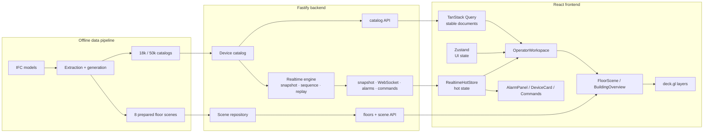

# Архитектура

Незакрытые риски ведутся в [`architecture-todo.md`](architecture-todo.md).

- Актуально на: 2026-08-10
- Статус: объединённые этапы 10–11 завершены и приняты; MVP завершён

## Границы системы



Браузер не получает raw IFC/protocol frames и не связывается с physical gateways. В production
Fastify выдаёт API, WebSocket и собранный frontend с одного origin.

## Владение состоянием

| Класс | Примеры | Владелец frontend | Обновление |
|---|---|---|---|
| Plan scene | walls, doors, labels, bounds | scene query cache / deck.gl | viewport/zoom query |
| Stable metadata | name, type, protocol, position, capabilities | TanStack Query | versioned document/invalidation |
| Hot state | telemetry, status, alarms, commands, cursor | indexed external store | ordered batches/full snapshot |
| UI-only | floor/device, filters, panels, command draft | Zustand | действия пользователя |
| Renderer | camera, layers, stable order, dirty ranges | hooks/deck.gl | controlled updates |

Transport arrays индексируются при ingestion. Telemetry event не пересоздаёт catalog. Устройства
не являются React/DOM elements.

## Доменные связи

```text
Building 1 -> many Floors
Floor    1 -> many DeviceMetadata
Device   1 -> latest DeviceTelemetry
Device   1 -> many Alarms
Device   1 -> many CommandRecords
```

`roomId` nullable; position хранится в floor-local Cartesian metres. `dataOrigin` равен `ifc`,
`derived` или `synthetic`; binding не содержит credentials.

## REST и realtime

| Method/path | Назначение |
|---|---|
| `GET /api/v1/catalog?buildingId&floorIds*` | cacheable stable catalog |
| `GET /api/v1/state/snapshot?buildingId&floorIds*` | authoritative hot replacement + cursor |
| `POST /api/v1/alarms/:alarmId/acknowledge` | idempotent acknowledgement |
| `POST /api/v1/commands` | idempotent simulated command |
| `GET /api/v1/commands/:commandId` | fallback без realtime |
| `GET /api/v1/realtime` + upgrade | ordered WebSocket stream |
| `POST /api/scene/query` | viewport/zoom geometry этапа 0 |

```text
GET snapshot -> (streamId, sequence, full hot state)
connect WS -> resume(streamId, afterSequence)
           <- hello + contiguous event.batch

reconnect -> resume(last cursor)
          <- replay
             или resync.required -> HTTP snapshot -> resume
```

Client принимает только contiguous fresh suffix. Duplicate/stale events не откатывают state; gap,
stream mismatch, unknown reference или invalid lifecycle отвергают batch и запускают single-flight
resync. Snapshot атомарно заменяет telemetry/alarms/commands/cursor, но не catalog/geometry.

## Жизненные циклы

```text
alarm:   active -> acknowledged -> resolved
         active ----------------> resolved

command: UI draft
         pending -> accepted -> executed | failed | timedOut
```

`clientRequestId` — idempotency key. Alarm/command REST response reconciles record без продвижения
WebSocket cursor; последующий ordered event делает обычное продвижение. Desired intent, backend
lifecycle и actual telemetry разделены. Только отдельный revisioned telemetry patch меняет actual.

## Рендеринг frontend

- Основная population рендерится одним instanced `IconLayer` с общим SVG atlas из 19 glyphs.
- Status filters выполняются `DataFilterExtension` на GPU при стабильном полном data array.
- Status updates меняют только dirty ranges; color/size показывают warning/critical без перегруппировки.
- Plan polygons/paths/labels, alarms и selection — независимые layers с собственным cadence/LOD.
- Alarm contours не скрываются device filters; overlays ограничены 50/10 React rows.
- GPU picking владеет hover/selection; на карте нет per-device JSX и массовых text labels.
- Building overview кеширует до восьми scene queries на zoom band.

## Граница производительности этапов 10–11

`playwright.performance.config.ts` запускает отдельные API/Vite ports, выбирает representative или
stress fixture и включает test-only burst route. Chromium использует ANGLE Metal; trace выключен,
поскольку screenshots синхронно читают WebGL canvas. В каждый JSON входят environment/GPU,
navigation, frame percentiles, long tasks по фазам, heap, React commits, realtime apply/latency и DOM.

Матрица 18 000/50 000 × desktop/Pixel 7 profile прошла заданные бюджеты. Spatial index, clustering,
workers, culling и binary attributes не добавлены: target measurement не показал узкого места,
оправдывающего сложность. Подробности: [`reports/performance.md`](../reports/performance.md).

## Runtime backend

Scene repository, catalog и realtime engine живут в памяти одного Node.js process. Engine хранит
building-scoped stream, bounded replay на 5 000 events, telemetry/alarm/command indexes и simulated
timers. Restart создаёт новый stream и требует snapshot resync. Performance routes отсутствуют, если
`ENABLE_PERFORMANCE_ROUTES` не равен `1`.

## Контракты

Source of truth: `src/shared/scene-contracts.ts`, `domain-contracts.ts`, `api-contracts.ts` и
`realtime-contracts.ts`. JSON Schema в `contracts/` генерируется; `npm run contracts:check` проверяет
freshness. Cross-record и lifecycle invariants проверяются runtime validators/engine/store.

## Проверка

- `npm run verify`: contracts, unit/API/component tests, strict types, builds, production smoke.
- `npm run test:e2e`: полный operator flow, alarms, commands, reconnect/polling/resume.
- `npm run test:performance`: representative/stress desktop/mobile profiles.
- Reliability tests покрывают duplicate/overlap/stale/gap/unknown, atomic alarm burst, bounded UI,
  nullable room, single-flight resync и stable idempotent retry.

## Известные ограничения

- State/replay/commands/idempotency process-local: нет database/durable event log.
- Нет production auth/authz, trusted identity, durable audit и physical protocol adapter.
- Mobile benchmark — device emulation на host Metal GPU, а не физический Android.
- Main JS chunk около 1 МБ minified из-за deck.gl; code splitting не оказался blocker текущего gate.
- Scene/catalog/snapshot имеют отдельные versions без общего compatibility handshake.
