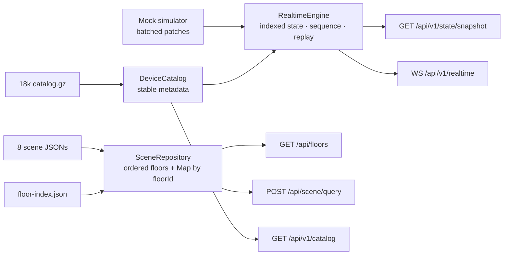

# Backend architecture

- Актуально на: 2026-08-09
- Текущий этап: Stage 5 реализован, ожидает приёмки
- Назначение: живое описание реализованного backend; обновляется при каждом этапе и существенном изменении API, хранения или runtime topology.

## Роль backend

Backend — Node.js/TypeScript-приложение на Fastify. Он выдаёт браузеру подготовленную геометрию, stable device metadata, authoritative operational snapshot и ordered WebSocket stream.



Backend не рендерит планы, не разбирает IFC на запросе и не подключается к физическим устройствам. Raw IFC обрабатывает отдельный offline pipeline.

## Почему Fastify

Fastify выполняет ту же роль, что Express: routes, lifecycle, plugins и static assets. Он выбран как TypeScript-friendly альтернатива с удобным `app.inject()` для тестов и plugin-моделью. Используются `@fastify/static`, `@fastify/compress` и `@fastify/websocket`; HTTP и WebSocket остаются внутри одного application boundary.

Высокая производительность Fastify сама по себе не является архитектурной гарантией. Для MVP важнее явные контракты, startup validation и тестируемый `buildApp()`.

## Runtime topology

Development:

```text
Browser :5173 -> Vite / HMR
                    └── /api HTTP + WS proxy -> Fastify 127.0.0.1:3001
```

Frontend использует относительные `/api/*`, поэтому штатному LAN/dev-потоку не нужен CORS.

Production:

```text
Browser -> one Fastify origin
           ├── /api/* HTTP
           ├── /api/v1/realtime WebSocket upgrade
           └── dist/web/* + SPA fallback
```

Render запускает один Node service и проверяет `/api/health`. JSON-ответы больше 1 024 bytes сжимаются `@fastify/compress` при поддерживаемом `Accept-Encoding`.

## Startup lifecycle и repositories

`src/server/index.ts` читает `PORT`, `HOST`, `NODE_ENV`, строит приложение и корректно закрывает его на `SIGINT/SIGTERM`. Network listener отделён от `buildApp()`, поэтому API tests работают через `app.inject()`.

### Scene repository

`scene-repository.ts`:

1. читает `west-riverside.floor-index.json`;
2. валидирует индекс;
3. по `sceneFile` читает и валидирует восемь `PreparedScene`;
4. проверяет соответствие floor ID;
5. сохраняет упорядоченные summaries и `Map<floorId, scene>`.

Каждый prepared scene dataset `west-riverside-stage-2-v2` содержит один сгенерированный convex-hull `floor-shell`. `PreparedSceneSchema` требует видимость shell во всём диапазоне `[-8, 24]` и покрытие bbox всех остальных features. Pipeline validator дополнительно требует ровно один shell и ненулевой count в каждом LOD band.

Все подготовленные scenes вместе занимают около 1,2 МБ. Они загружаются один раз при старте. `sceneDatasetVersion` берётся из floor index.

### Device catalog repository

`device-catalog.ts` синхронно читает и распаковывает `west-riverside.devices-18000.json.gz`, валидирует полный `DeviceCatalog` и хранит его в памяти. Gzip-файл около 471 КБ. `selectCatalogFloors()` создаёт floor/building scope линейной фильтрацией массива.

### Stage 5 realtime engine

`state-snapshot.ts` отдельно от catalog вычисляет initial `DeviceTelemetry` на устройство:

- fixed timestamp и revision;
- status/connection по стабильному hash `deviceId`;
- telemetry values в соответствии с объявленными capabilities;
- `normal`: 16 906, `warning`: 473, `critical`: 189, `offline`: 432;
- initial revision `1`.

`RealtimeEngine` копирует initial telemetry в authoritative indexed state, создаёт новый `streamId` на процесс и владеет глобальным building sequence. Snapshot строится из текущего состояния и валидируется целиком через `StateSnapshotSchema`. Status не записывается в `DeviceMetadata`.

Mock simulator раз в 250 мс генерирует один batch из 24 telemetry patches (96 events/s). Value меняется часто, status существенно реже, чтобы обычный поток проверял hot values без постоянной полной перегруппировки renderer. Engine принимает только revision новее текущей, назначает каждому событию contiguous sequence, хранит последние 5 000 событий и уведомляет listeners один раз на batch. Timer запускается только в runtime server через `onReady` и останавливается через `onClose`; injected API tests остаются детерминированными.

## HTTP API

### `GET /api/health`

Возвращает `{ "status": "ok" }`; используется Render и production smoke test.

### `GET /api/floors`

Возвращает восемь подготовленных этажей в порядке `order`: Level 1–6, Level 7A, Level 7. Каждый summary содержит ID, name, elevation, bounds и order.

### `POST /api/scene/query`

```json
{
  "floorId": "west-riverside-level-2",
  "viewport": { "bbox": [0, 0, 104, 98], "width": 1200, "height": 800 },
  "zoom": 3.5
}
```

`SceneQuerySchema` валидирует body. Repository находит этаж, после чего backend оставляет features, пересекающие bbox и удовлетворяющие `minZoom <= zoom <= maxZoom`. Bands: `overview < 1.7`, `standard < 4.1`, иначе `detail`. `sceneVersion` объединяет dataset version и floor ID. Устройств в ответе нет.

`meta.emptyReason` равен `null` для непустого ответа. Для успешного пустого ответа он различает `viewport-outside-floor`, `no-spatial-features` и `lod-filtered`; transport error этим полем не маскируется. Благодаря full-range shell валидный viewport с архитектурными spatial candidates не становится пустым только из-за LOD.

### `GET /api/v1/catalog`

```http
GET /api/v1/catalog?buildingId=west-riverside&floorIds=<id>&floorIds=<id>
```

`floorIds` опционален и повторяем. Без него возвращается весь каталог на 18 000 устройств. Endpoint проверяет building/floors, возвращает только stable metadata, добавляет scope-dependent `ETag` и `Cache-Control: public, max-age=300, stale-while-revalidate=60`; совпавший `If-None-Match` получает `304`.

### `GET /api/v1/state/snapshot`

Query scope совпадает с catalog. Ответ содержит отдельные `telemetry`, `alarms`, `commands`, `streamId`, `sequence` и `generatedAt`. Для одного этажа число telemetry records равно числу устройств его catalog; без `floorIds` возвращается 18 000. Snapshot имеет собственный scope-dependent `ETag` и поддерживает точный conditional `304` для неизменившегося cursor.

Stage 5 snapshot отражает mutable engine state, поэтому `snapshotId` и `ETag` включают stream/sequence, а ответ имеет `Cache-Control: no-store`. Он является атомарной точкой восстановления, а не периодически обновляемым query cache.

### `GET /api/v1/realtime` — WebSocket upgrade

После client `resume` endpoint отправляет `hello`, проверяет building/floor scope и cursor, затем синхронно отдаёт накопленный replay и подписывает socket на новые batches. Если stream изменился, cursor находится впереди server или выпал из retention window, сервер возвращает `resync.required` с причиной `streamChanged`, `serverRestart` или `cursorExpired` и snapshot path. Heartbeat отправляется каждые 5 секунд.

Sequence принадлежит всему building stream. Сервер не вырезает floor-specific события из batch: иначе один общий cursor получил бы ложные gaps. Floor scope остаётся допустимым в handshake для будущей маршрутизации, но текущий Stage 5 клиент bootstrap/resume делает по зданию.

## Контракты и разделение данных

Runtime source of truth находится в `src/shared`:

- `scene-contracts.ts` — floor, scene query/response;
- `domain-contracts.ts` — metadata, telemetry, alarm, command;
- `api-contracts.ts` — catalog/snapshot/operational REST;
- `realtime-contracts.ts` — Stage 5 ordered transport.

```text
scene repository    -> geometry, keyed by floorId
device catalog      -> stable metadata, keyed by deviceId/floorId
realtime engine     -> authoritative hot data + ordered replay, keyed by entity ID
```

Данные не мержатся на backend. JSON Schema artifacts в `contracts/` генерируются из Zod и проверяются `npm run contracts:check`.

## Ошибки, caching и compression

- `400` — schema-invalid query/body;
- `404` — неизвестный building/floor;
- `304` — совпавший catalog ETag или точный snapshot stream/sequence ETag;
- `200` — успешный ответ.

Stage 0/3/4 routes ещё используют упрощённые `{ error, details? }`; единый `ApiError` middleware остаётся будущим улучшением. Compression применяется глобально к достаточно большим ответам, но ETag вычисляется из version/scope, а не из encoded body.

## Проверки Stage 5

API coverage проверяет:

- список и порядок восьми этажей;
- scene query другого этажа и dataset-aware version;
- viewport/zoom filtering;
- обязательный full-range `floor-shell` во всех восьми full-floor overview responses;
- empty reason для outside/no-spatial/LOD-filtered случаев;
- одиночный и повторяемый floor scope каталога;
- отсутствие status в stable metadata;
- authoritative snapshot на 2 900 и 18 000 records;
- наличие warning/critical, connection invariant, ETag и `304`;
- validation errors для неизвестных scopes.

Realtime coverage дополнительно проверяет contiguous batch, stale per-device revisions, bounded replay, expired cursor, stream change/server restart resync, live delivery и coalesced burst на 1 000 events. Production smoke открывает compiled WebSocket endpoint, resume-ится от только что полученного snapshot cursor и ждёт следующий batch.

Production smoke проверяет compiled server, HTML, scene, catalog, snapshot и realtime batch.

## Ограничения и следующий шаг

- Scenes, catalog и authoritative hot state находятся в памяти одного процесса; restart создаёт новый stream и требует resync.
- Floor selection линейно фильтрует 18 000 records; индексы пока не нужны по измерениям этого этапа.
- Нет database, authentication/authorization, audit log и включённого Fastify logger.
- Scene/catalog/snapshot имеют отдельные version tokens; runtime compatibility handshake ещё не реализован.
- Replay находится только в памяти и ограничен 5 000 событиями; это намеренный MVP fallback к authoritative snapshot, не durable event log.

Stage 6 добавит alarm lifecycle и REST mutations поверх уже существующих `alarmsById`/`alarm.upsert`; telemetry stream и stable catalog останутся отдельными.
