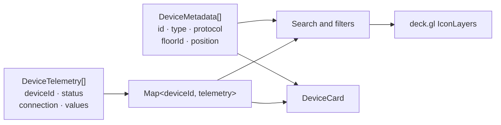
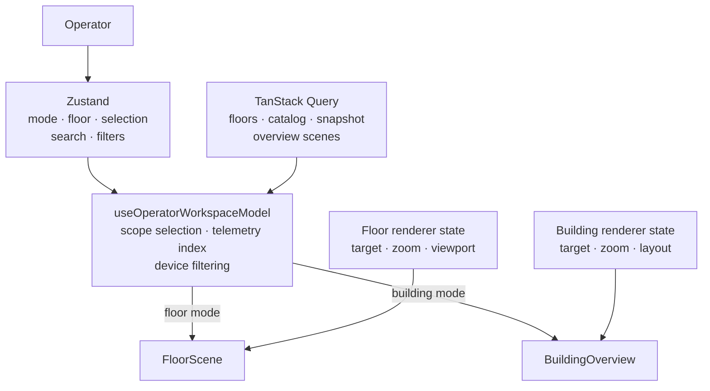
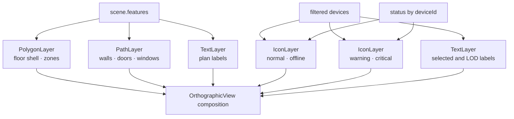

# Frontend architecture

- Актуально на: 2026-08-09
- Текущий этап: Stage 4, реализован, ожидает приёмки
- Назначение: живое описание реализованного frontend; обновляется при каждом этапе и существенном изменении data flow.

## Пользовательский результат

Frontend поддерживает два режима:

- `Floor` — один из восьми этажей West Riverside Hospital;
- `Building` — восемь небольших планов рядом и все 18 000 устройств.

В обоих режимах работают pan, wheel/touch zoom, fit, GPU picking и одна карточка выбранного устройства. Панель оператора переключает этажи, ищет по имени/ID и фильтрует по типу, протоколу и operational status.

## Компонентная схема

```text
QueryClientProvider
└── App
    ├── useQuery(GET /api/floors)
    └── OperatorWorkspace
        ├── useOperatorWorkspaceModel
        │   ├── Zustand: mode, floor, selection, search, filters
        │   ├── useQuery(GET /api/v1/catalog)
        │   └── useQuery(GET /api/v1/state/snapshot)
        ├── OperatorToolbar
        └── FloorScene | BuildingOverview
            ├── scene controller / layer hooks
            ├── architecture layers
            │   ├── PolygonLayer
            │   ├── PathLayer
            │   └── TextLayer
            ├── device layers
            │   ├── IconLayer: normal/offline devices
            │   ├── IconLayer: warning/critical devices, rendered last
            │   └── TextLayer: selected/LOD labels
            └── React overlays
                ├── zoom / fit
                ├── diagnostics
                └── one DeviceCard
```

## Три независимых потока данных

Frontend не мержит сцену и устройства в единый transport document:

```text
POST /api/scene/query   -> scene.features       -> plan layers
GET  /api/v1/catalog    -> DeviceMetadata[]     -> device positions/icons
GET  /api/v1/state/...  -> DeviceTelemetry[]    -> color/status/card values
```

Связи выполняются по `floorId` и `deviceId`. Сцена и устройства визуально совпадают благодаря общей floor-local системе координат, а не потому, что устройства находятся в scene response.

### Архитектурная сцена

`SceneFeature` содержит только `floor-shell`, `zone`, `wall`, `column`, `door`, `window`, `stair` и `label`. В floor mode запрос зависит от viewport и zoom, выполняется с debounce 100 мс, а предыдущий запрос отменяется. В building overview React Query получает по одной полной floor-local сцене на этаж для текущего zoom band и повторно использует кеш между переключениями.

### Stable device catalog

`DeviceMetadata` содержит имя, тип, протокол, floor-local позицию, provenance, binding и capabilities. Status намеренно отсутствует. React Query кеширует floor-scoped или building-scoped ответ 5 минут; pan/zoom не перезапрашивает каталог.

### Stage 4 status snapshot

`DeviceTelemetry` загружается отдельно тем же floor/building scope и индексируется один раз в `Map<deviceId, telemetry>`. Snapshot детерминированный и read-only: он позволяет закончить status rendering/filtering до появления WebSocket и hot store в Stage 5. Он не изменяет stable metadata.



Диаграмма подчёркивает, что status не является полем `DeviceMetadata`: catalog и snapshot соединяются на frontend по `deviceId`.

## Владение состоянием

| Состояние | Владелец | Причина |
|---|---|---|
| Floors, catalog, snapshot, overview scenes | TanStack Query | серверные документы, cache/dedup/stale policy |
| Mode, selected floor/device, search, filters | Zustand `operator-store` | общее UI-состояние без prop drilling |
| Camera `viewState`, текущая floor scene | `useFloorScene` / `BuildingOverview` | локальное высокочастотное состояние renderer |
| Indexed telemetry lookup | `useOperatorWorkspaceModel` memoized `Map` | O(1) соединение metadata и status |
| Filtered device array | `useOperatorWorkspaceModel` memoized selector | один массив данных для GPU layers |



При смене scope catalog и snapshot запрашиваются согласованно. При смене этажа выбранное устройство сбрасывается. Filters меняют массив instances deck.gl, но не создают DOM-маркер на устройство.

### Точки взаимодействия TanStack Query и Zustand

Библиотеки не обращаются друг к другу напрямую и не дублируют состояние. Их связывают `App` и `useOperatorWorkspaceModel`: Zustand определяет пользовательский scope и локальные преобразования, а TanStack Query возвращает соответствующие серверные документы. `OperatorWorkspace` после рефакторинга только компонует toolbar и нужный renderer по готовой view model.

```text
OperatorToolbar event
        │
        ▼
Zustand: viewMode / selectedFloorId / filters / selectedDeviceId
        │
        ├── viewMode + selectedFloorId -> floorIds -> TanStack queryKey
        │                                      │
        │                                      ▼
        │                            catalog + snapshot data
        │                                      │
        ├── search/type/protocol/status filters┘
        │                    │
        │                    ▼
        │             filteredDevices
        │
        └── selectedDeviceId + catalog data -> selectedDevice
```

| Место | Данные TanStack Query | Состояние Zustand | Результат взаимодействия |
|---|---|---|---|
| `App.tsx` | `floorsQuery.data` | `viewMode`, `selectedFloorId` | выбранный этаж и заголовок приложения |
| `use-operator-workspace.ts`, scope | загруженный список `floors` | `viewMode`, `selectedFloorId` | `floorIds` для catalog/snapshot query keys; смена ключа выбирает кеш нужного scope или запускает запрос |
| `use-operator-workspace.ts`, initialization | первый элемент `floors` | `setSelectedFloorId` | первый загруженный этаж становится выбранным, если выбор ещё не сделан |
| `use-operator-workspace.ts`, filtering | `catalogQuery.data.devices`, `snapshotQuery.data.telemetry` | `search`, type/protocol/status filters | единый `filteredDevices` для counters, layers, labels и picking; изменение фильтра не делает сетевой запрос |
| `use-operator-workspace.ts`, selection | `catalogQuery.data.devices` | `selectedDeviceId` | поиск полного `selectedDevice`; canvas click записывает ID через `setSelectedDeviceId` |
| `OperatorWorkspace.tsx`, composition | готовые `isLoading`/`requestError`/data из view model | `viewMode` внутри view model | loading/error UI и выбор `FloorScene` либо `BuildingOverview` |

Query keys находятся в `operator-queries.ts`: `['device-catalog', scope]` и `['state-snapshot', scope]`, где scope — ID этажа или `building`. Search и filters намеренно не входят в query key, потому что это локальные UI-преобразования уже загруженного документа. `selectedDeviceId` также хранится только в Zustand: в серверный кеш попадает устройство, но не пользовательский выбор.

Чистое правило фильтрации находится в `operator-devices.ts`. Хук передаёт ему catalog, telemetry index и текущие Zustand filters, поэтому комбинации search/type/protocol/status тестируются отдельно от React Query и store lifecycle.

На следующих этапах этот раздел обновляется при любом изменении query keys, cache/stale policy, состава Zustand store, правил scope, client-side filtering/selection или при переносе telemetry из snapshot query в realtime hot state.

## Floor и building rendering

### FloorScene

- `FloorScene` — тонкая JSX-композиция без загрузки данных и конструирования deck.gl layers в render body;
- `useFloorScene` владеет камерой, auto-fit, debounced/abortable scene query и GPU picking;
- `useFloorSceneLayers` вычисляет LOD labels, делит features по geometry type и создаёт architecture/device layers;
- fit вычисляется из bounds выбранного этажа;
- архитектура запрашивается по реальному bbox камеры;
- отфильтрованные устройства передаются в два instanced `IconLayer`;
- picking ограничен device layer IDs;
- карточка показывается только для устройства текущего этажа.

### BuildingOverview

- этажи раскладываются в сетку 4 колонки на desktop и 2 на mobile;
- floor-local координаты временно смещаются на layout offset;
- архитектура восьми этажей объединяется по типам в общие layers;
- все 18 000 устройств остаются WebGL instances, а не React-компонентами;
- fit охватывает общий layout; pan/zoom и picking используют одну `OrthographicView`.

### Композиция WebGL-слоёв



Порядок слоёв существенен: warning/critical `IconLayer` идёт после обычного device layer, поэтому при визуальном пересечении приоритетные состояния остаются сверху.

Общие для двух renderer правила вынесены из компонентов: `device-layers.ts` индексирует status, делит normal/priority instances и создаёт одинаково настроенный `IconLayer`, а `SceneControls` реализует единые zoom/fit controls. Поэтому floor и overview не расходятся по цветам, размерам, picking-настройкам и шагу zoom.

## Zoom и LOD

`viewState.zoom` управляет камерой и одновременно влияет на четыре подсистемы:

```text
user input / Fit
       │
       ▼
 viewState.zoom
   ├── camera scale = 2 ** zoom
   ├── visible world bbox
   ├── backend architecture LOD
   ├── device icon size/status emphasis
   └── device label policy
```

Architecture bands:

- `overview`: zoom `< 1.7`;
- `standard`: `1.7 <= zoom < 4.1`;
- `detail`: zoom `>= 4.1`.

Обычная device icon имеет размер 7/10/14 px по диапазонам zoom. Warning — 11/14/17 px, critical — 13/16/19 px. Warning/critical instances выделены в отдельный слой, рисуются поверх остальных и не исчезают из-за renderer LOD. Offline/normal остаются в основном слое.

Подписи ограничены, чтобы не создать визуальный и CPU-шум:

- выбранное устройство подписано всегда;
- warning/critical в floor mode подписываются со среднего приближения;
- обычные подписи появляются только при zoom `>= 5.2`, только внутри viewport и максимум 180 одновременно;
- архитектурные подписи продолжают регулироваться scene LOD.

Пороги, лимит и device layer IDs централизованы в `floor-scene-config.ts`; чистая функция `selectFloorDeviceLabels` в `floor-scene-labels.ts` реализует выбор подписей. Хук слоёв отвечает только за memoization и передачу результата в `TextLayer`.

## Search и filters

Поиск case-insensitive по `device.name` и `device.id`. Type и protocol сравниваются со stable catalog; status — с отдельным telemetry map. Фильтры применяются до передачи данных в deck.gl, поэтому counters, status overlay, labels и picking работают с одним и тем же видимым набором.

`Reset` очищает search/type/protocol/status, не меняя mode и выбранный этаж.

## Selection и GPU picking

Клик по canvas вызывает `DeckGLRef.pickObject()` с radius 4 и только с device layer IDs. Возвращённый instance преобразуется в `deviceId`, который хранится в Zustand. React создаёт ровно одну `DeviceCard`; карточка соединяет stable metadata с текущим snapshot и показывает status, connection и до четырёх telemetry values.

## Основные frontend-файлы

| Файл | Ответственность |
|---|---|
| `src/client/src/App.tsx` | shell, floors query, заголовок режима |
| `src/client/src/OperatorWorkspace.tsx` | декларативная композиция toolbar и выбранного renderer |
| `src/client/src/use-operator-workspace.ts` | query scope, telemetry index, filters, selection view model |
| `src/client/src/operator-devices.ts` | чистая фильтрация catalog по search/type/protocol/status |
| `src/client/src/operator-store.ts` | UI state на Zustand |
| `src/client/src/operator-api.ts` | catalog и snapshot clients + Zod parse |
| `src/client/src/operator-queries.ts` | React Query keys/cache policy |
| `src/client/src/OperatorToolbar.tsx` | mode/floor/search/filter controls |
| `src/client/src/FloorScene.tsx` | декларативная композиция floor renderer и overlays |
| `src/client/src/use-floor-scene.ts` | camera, fit, scene request lifecycle и GPU picking |
| `src/client/src/use-floor-scene-layers.ts` | floor architecture/device layers и label LOD |
| `src/client/src/floor-scene-config.ts` | layer IDs, debounce и label LOD thresholds/limit |
| `src/client/src/floor-scene-labels.ts` | чистый выбор device labels для текущих zoom и viewport |
| `src/client/src/BuildingOverview.tsx` | layout и rendering всех этажей |
| `src/client/src/DeviceCard.tsx` | selected device metadata + snapshot |
| `src/client/src/SceneControls.tsx` | общие zoom/fit controls двух renderer |
| `src/client/src/device-layers.ts` | общие status partition и фабрика device `IconLayer` |
| `src/client/src/device-visuals.ts` | atlas mapping, status colors, icon LOD |
| `src/client/src/scene-visuals.ts` | scene colors и zoom bands |
| `src/client/src/viewport.ts` | floor/building fit и bbox conversion |

## Тестовые границы

- Чистые unit-тесты фиксируют status partition, поиск и комбинации filters, label zoom thresholds, viewport culling, deduplication и лимит 180.
- Hook-тест `useFloorScene` с fake timers фиксирует 100 мс debounce, bbox/zoom request и abort устаревшего запроса при смене камеры.
- Chromium E2E проверяет связанный пользовательский поток: floor switch, filters, overview, zoom и GPU picking.

## Ограничения и следующий шаг

- Snapshot статичен; realtime, reconnect, resync и event batching относятся к Stage 5.
- Telemetry пока хранится в memoized `Map`, а не в специализированном внешнем hot store.
- Catalog и snapshot целиком передаются для выбранного scope; device spatial culling/clustering не добавлялись без benchmark.
- Overview делает до восьми scene queries на новый zoom band; ответы кешируются, но пока не объединены в отдельный backend batch endpoint.
- Главный JS chunk около 1 МБ minified из-за deck.gl; code splitting оставлен как измеряемая оптимизация, а не блокер MVP.

Stage 5 должен заменить статический snapshot на authoritative snapshot + ordered realtime transport и индексированный hot state, сохранив stable catalog и renderer state раздельными.
