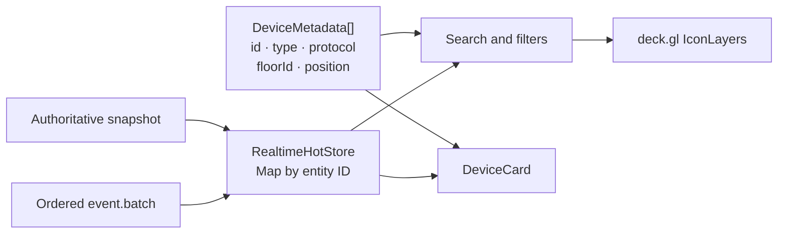
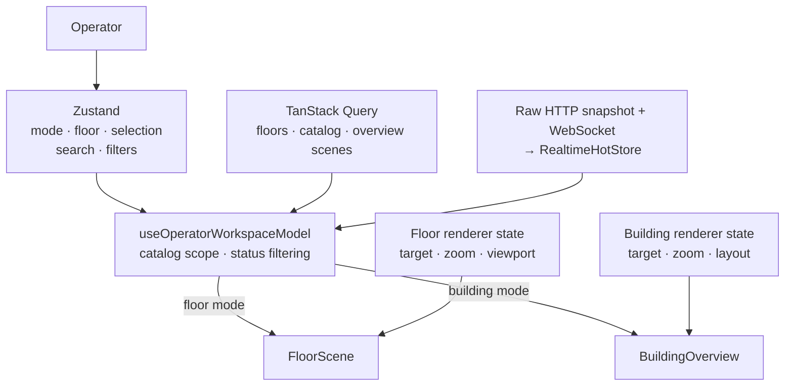
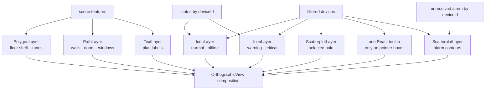

# Frontend architecture

Подробный пошаговый путь данных от HTTP/WebSocket до компонентов и deck.gl описан в [`frontend-data-consumption.md`](frontend-data-consumption.md). Взаимодействие `RealtimeClient` и `RealtimeHotStore` разобрано отдельно в [`realtime-client-and-hot-store.md`](realtime-client-and-hot-store.md).

- Актуально на: 2026-08-10
- Текущий статус: объединённый Stage 8–9 завершён и принят; Stage 10 не начат
- Назначение: живое описание реализованного frontend; обновляется при каждом этапе и существенном изменении data flow.

## Пользовательский результат

Frontend поддерживает два режима:

- `Floor` — один из восьми этажей West Riverside Hospital;
- `Building` — восемь небольших планов рядом и все 18 000 устройств.

В обоих режимах работают pan, wheel/touch zoom, fit, GPU picking и одна карточка выбранного устройства. Кнопка `Alarms` стоит первой в toolbar. Панель оператора переключает этажи, ищет по имени/ID и multi-select фильтрует устройства тремя checkbox-рядами: status, protocol и type. Warning/critical alarms видны отдельным контуром на плане; оператор может отфильтровать lifecycle, перейти к устройству и подтвердить active alarm. Карточка строит command draft из capabilities, требует confirmation для критичных действий и отдельно показывает desired intent, backend lifecycle и actual telemetry. При потере realtime HTTP-команда остаётся явной, lifecycle временно отслеживается polling, а reconnect продолжает ordered stream от последнего применённого cursor.

## Компонентная схема

```text
QueryClientProvider
└── App
    ├── useQuery(GET /api/floors)
    └── OperatorWorkspace
        ├── useOperatorWorkspaceModel
        │   ├── Zustand: mode, floor, selection, search, filters, command draft
        │   ├── useQuery(GET /api/v1/catalog)
        │   ├── raw GET /api/v1/state/snapshot — bootstrap/resync
        │   └── realtime selectors: renderer status + alarms
        ├── OperatorToolbar — cursor/connection + active alarm count
        ├── AlarmPanel — filters · locate · acknowledge
        └── FloorScene | BuildingOverview
            ├── scene controller / layer hooks
            ├── architecture layers
            │   ├── PolygonLayer
            │   ├── PathLayer
            │   └── TextLayer
            ├── device layers
            │   ├── IconLayer: normal/offline devices
            │   ├── IconLayer: warning/critical devices, rendered last
            │   ├── ScatterplotLayer: current selection halo
            │   └── ScatterplotLayer: unresolved alarm contours
            └── React overlays
                ├── zoom / fit
                ├── diagnostics
                ├── one hover device tooltip
                └── one DeviceCard
                    ├── selected-device telemetry/alarm/command selectors
                    └── CommandControls — draft · confirmation · history
```

## Три независимых потока данных

Frontend не мержит сцену и устройства в единый transport document:

```text
POST /api/scene/query   -> scene.features       -> plan layers
GET  /api/v1/catalog    -> DeviceMetadata[]     -> device positions/icons
GET  /api/v1/state/...  -> authoritative bootstrap/resync
WS   /api/v1/realtime   -> ordered event.batch -> indexed hot state
POST /api/v1/commands   -> pending reconciliation -> indexed commands
```

Связи выполняются по `floorId` и `deviceId`. Сцена и устройства визуально совпадают благодаря общей floor-local системе координат, а не потому, что устройства находятся в scene response.

### Архитектурная сцена

`SceneFeature` содержит только `floor-shell`, `zone`, `wall`, `column`, `door`, `window`, `stair` и `label`. В floor mode запрос зависит от viewport и zoom, выполняется с debounce 100 мс, а предыдущий запрос отменяется. В building overview React Query получает по одной полной floor-local сцене на этаж для текущего zoom band и повторно использует кеш между переключениями.

Каждый этаж содержит один базовый `floor-shell`, видимый во всём поддерживаемом zoom. Если успешный scene response всё же пуст, `meta.emptyReason` отличает viewport вне этажа, отсутствие spatial features и LOD filtering. `FloorScene` показывает оператору центральный diagnostic empty-state с подсказкой Fit; `BuildingOverview` выводит количество пустых floor responses в status overlay. Loading и transport error остаются отдельными состояниями.

### Stable device catalog

`DeviceMetadata` содержит имя, тип, протокол, floor-local позицию, provenance, binding и capabilities. Status намеренно отсутствует. Stage 6 постоянно кеширует building catalog 5 минут, а floor scope вычисляет локально. Это позволяет `AlarmPanel` перейти к устройству любого этажа без дополнительного запроса; pan/zoom и telemetry/alarm events каталог не перезапрашивают.

### Stage 5 realtime hot state

Building-scoped `StateSnapshot` загружается сырым abortable HTTP-запросом прямо из `useRealtimeBootstrap` и сразу заменяет hot store; TanStack Query не хранит копию operational state. После этого `RealtimeClient` открывает WebSocket, отправляет `resume(streamId, afterSequence)` и применяет только непрерывные `event.batch`. Duplicate sequence игнорируется; gap, смена stream и неизвестное локальное состояние запускают такой же прямой HTTP snapshot resync. После disconnect клиент переподключается с exponential backoff 250–5 000 мс и повторно использует последний cursor.

`RealtimeHotStore` — отдельный внешний store, не Zustand и не TanStack Query. Он атомарно заменяет snapshot и хранит индексированные `Map` для telemetry, status, alarms и commands. Один batch публикует одно store notification; per-device revision не даёт позднему patch затереть более новое значение.

HTTP command response reconciles в тот же `commandsById`, не меняя cursor. Lifecycle rank не позволяет более медленному `pending` response откатить уже полученный через WebSocket `accepted`/terminal record.



Диаграмма подчёркивает, что status не является полем `DeviceMetadata`: stable catalog и hot store соединяются на frontend по `deviceId`.

## Владение состоянием

| Состояние | Владелец | Причина |
|---|---|---|
| Floors, catalog, overview scenes | TanStack Query | стабильные или повторно используемые серверные документы, cache/dedup/stale policy |
| Bootstrap/resync snapshot | `useRealtimeBootstrap` / `RealtimeClient` | прямой abortable HTTP request сразу заменяет hot store; отдельного stale query cache нет |
| Mode, selected floor/device, search/device/alarm filters, panel | Zustand `operator-store` | общее UI-состояние без prop drilling |
| Camera `viewState`, текущая floor scene | `useFloorScene` / `BuildingOverview` | локальное высокочастотное состояние renderer |
| Indexed hot state и realtime cursor | `RealtimeHotStore` + `useSyncExternalStore` selectors | O(1) lookup и изолированные React subscriptions |
| Filtered device array | `useOperatorWorkspaceModel` memoized selector | один массив данных для GPU layers |



Catalog, hot snapshot и realtime cursor остаются building-scoped. Workspace локально выбирает устройства текущего этажа, чтобы переход из building-wide alarm list был мгновенным и чтобы фильтрация событий по этажу не создавала ложных sequence gaps. При обычной смене этажа выбранное устройство сбрасывается. Filters меняют массив instances deck.gl, но не создают DOM-маркер на устройство.

### Точки взаимодействия TanStack Query и Zustand

Библиотеки не обращаются друг к другу напрямую и не дублируют состояние. Их связывают `App` и `useOperatorWorkspaceModel`: Zustand определяет пользовательский scope и локальные преобразования, а TanStack Query возвращает соответствующие серверные документы. `OperatorWorkspace` после рефакторинга только компонует toolbar и нужный renderer по готовой view model.

```text
OperatorToolbar event
        │
        ▼
Zustand: viewMode / selectedFloorId / filter arrays / selectedDeviceId / alarm panel
        │
        ├── building catalog queryKey ──────────┐
        │                                      │
        ├── viewMode + selectedFloorId ────────┤
        │                                      ▼
        ├── search + type/protocol/status sets -> filteredDevices
        │                    │
        │                    ▼
        │             filteredDevices
        │
        └── selectedDeviceId + catalog data -> selectedDevice
```

| Место | Данные TanStack Query | Состояние Zustand | Результат взаимодействия |
|---|---|---|---|
| `App.tsx` | `floorsQuery.data` | `viewMode`, `selectedFloorId` | выбранный этаж и заголовок приложения |
| `use-operator-workspace.ts`, scope | building catalog и список `floors` | `viewMode`, `selectedFloorId` | локальный floor subset без смены catalog query key; snapshot/realtime также building-scoped |
| `use-operator-workspace.ts`, initialization | первый элемент `floors` | `setSelectedFloorId` | первый загруженный этаж становится выбранным, если выбор ещё не сделан |
| `use-operator-workspace.ts`, filtering | `catalogQuery.data.devices`; status selector из hot store | `search`, type/protocol/status filters | единый `filteredDevices`; status updates пересчитывают его только при активном status filter |
| `use-operator-workspace.ts`, selection | `catalogQuery.data.devices` | `selectedDeviceId` | поиск полного `selectedDevice`; canvas click записывает ID через `setSelectedDeviceId` |
| `OperatorWorkspace.tsx`, composition | готовые `isLoading`/`requestError`/data из view model | `viewMode` и alarm panel state | loading/error UI, выбор renderer и building-wide `AlarmPanel` |

Operational snapshot больше не имеет query key: `operator-queries.ts` использует `['device-catalog', 'building']`, а overview scenes — `['overview-scene', floorId, zoomBand]`. Search, floor selection и filters намеренно не входят в query key, потому что это локальные UI-преобразования уже загруженного документа. `selectedDeviceId` и alarm panel filters также хранятся только в Zustand.

Чистое правило фильтрации находится в `operator-devices.ts`. Хук передаёт ему catalog, status index и текущие Zustand filters, поэтому комбинации search/type/protocol/status тестируются отдельно от React Query и store lifecycle.

На следующих этапах этот раздел обновляется при любом изменении query keys, cache/stale policy, состава Zustand/hot store, правил scope или client-side filtering/selection.

## Stage 6 alarm consumption

`alarmsById` приходит из authoritative snapshot и обновляется полным `alarm.upsert` в общем ordered stream. `AlarmPanel` подписывается на identity этой map и `statusByDeviceId`, а чистые selectors сортируют lifecycle в порядке `active → acknowledged → resolved`, фильтруют severity/state и выбирают один strongest unresolved alarm на устройство. Stable type/protocol берутся из building catalog по `deviceId`, текущий status — из hot store.

Подтверждение выполняет `POST /api/v1/alarms/:alarmId/acknowledge` с mock actor `demo-operator` и клиентским UTC timestamp. Runtime-проверенный HTTP response сразу reconciles `alarmsById`, но не двигает WebSocket cursor. Сервер одновременно публикует тот же record как sequenced `alarm.upsert`; повторная запись идемпотентна, а stream sequence применяется обычным путём.

План не выводит alarm как DOM marker и не подменяет им telemetry status. `alarm-layers.ts` создаёт отдельный instanced `ScatterplotLayer` из unresolved alarms: active warning/critical различаются цветом, acknowledged получает приглушённый контур, resolved остаётся только в истории списка. Marker data строится по полному floor/building scope и поэтому не исчезает из-за search/device filters.

`Locate` находит metadata в building catalog, одним Zustand transition переключает floor mode, выбирает этаж и устройство и очищает device filters. Alarm panel остаётся открытым слева, а карточка устройства появляется справа, поэтому оператор сохраняет контекст списка. На узком экране overlays делят сцену по вертикали. Карточка читает alarms и telemetry независимо и показывает audit author/time после acknowledgement. `DeviceVisualMarkers` даёт toolbar filters, alarm rows и selected-device card единый визуальный язык: atlas icon типа, краткий protocol badge и цветной квадрат текущего telemetry status; severity/state аварии при этом остаются отдельными признаками.

## Stage 7 command consumption

`CommandControls` читает immutable capability выбранного `DeviceMetadata` и создаёт schema-shaped `CommandDraft` в Zustand. Переключение capability или устройства заменяет draft; закрытие карточки очищает его. `setOnOff` использует boolean select, `setSetpoint` — numeric input с contract `minimum`, `maximum` и `step`.

Если capability содержит `requiresConfirmation`, submission сначала открывает modal confirmation dialog. Только явное подтверждение добавляет mock audit fields `confirmedAt`/`confirmedBy` и вызывает `POST /api/v1/commands`. Некритичная capability отправляется напрямую. REST response проходит Zod parsing и немедленно попадает в `RealtimeHotStore.upsertCommand`; последующие `command.upsert` двигают общий ordered cursor.

Карточка показывает не более пяти последних commands устройства. Каждая запись содержит три отдельные строки: immutable desired intent, backend state и independently selected actual telemetry. Сначала `executed` меняет backend badge; только более поздний `telemetry.patch` меняет `Actual`. Frontend никогда не подставляет intent в telemetry самостоятельно.

## Stage 8–9 reliability boundary

`RealtimeHotStore` применяет batch атомарно и reconciles alarm/command records монотонно. Полный
duplicate и stale entity revision не меняют domain data; overlap batch применяет только свежий
contiguous suffix. Gap, changed stream, unknown-device reference, conflicting alarm identity или
terminal command outcome возвращают recovery result до publish, поэтому частичный batch не виден
ни одному subscriber. `RealtimeClient` coalesces одновременные resync triggers одним snapshot request.

`CommandDraft` содержит стабильные `clientRequestId` и nullable `requestedAt`. Первая попытка
фиксирует timestamp; неопределённый network/response outcome оставляет exact request для явной
кнопки `Retry same command`. Background resubmit запрещён. `useCommandStatusFallback` при любом
не-live connection status опрашивает все известные non-terminal commands через GET и прекращает
polling при terminal state или возвращении realtime.

Alarm maps сохраняют все записи и полные counts, но `AlarmPanel` рендерит максимум 50 строк, а
`DeviceCard` — 10 alarms выбранного устройства. Это ограничивает DOM work во время burst, не
удаляя operational state. Карточка также явно показывает nullable `roomId` как `Unassigned`.

## Floor и building rendering

### FloorScene

- `FloorScene` — тонкая JSX-композиция без загрузки данных и конструирования deck.gl layers в render body;
- `useFloorScene` владеет камерой, auto-fit, debounced/abortable scene query и GPU picking;
- `useFloorSceneLayers` делит features по geometry type и создаёт architecture/device/alarm/selection layers;
- fit вычисляется из bounds выбранного этажа;
- архитектура запрашивается по реальному bbox камеры;
- отфильтрованные устройства передаются в два instanced `IconLayer`;
- unresolved alarms текущего этажа передаются в отдельный `ScatterplotLayer` независимо от device filters;
- picking ограничен device layer IDs;
- карточка показывается только для устройства текущего этажа.
- нижний status overlay разделяет geometry и device/zoom metrics на две строки; полупрозрачный фон с blur сохраняет читаемость, не перехватывая события сцены.

### BuildingOverview

- этажи раскладываются в сетку 4 колонки на desktop и 2 на mobile;
- floor-local координаты временно смещаются на layout offset;
- архитектура восьми этажей объединяется по типам в общие layers;
- все 18 000 устройств остаются WebGL instances, а не React-компонентами;
- unresolved alarms всех этажей получают те же layout offsets, что их устройства;
- fit охватывает общий layout; pan/zoom и picking используют одну `OrthographicView`.

### Композиция WebGL-слоёв



Порядок слоёв существенен: warning/critical `IconLayer` идёт после обычного device layer, поэтому при визуальном пересечении приоритетные состояния остаются сверху.

Общие для двух renderer правила вынесены из компонентов: `device-layers.ts` индексирует status, делит normal/priority instances и создаёт одинаково настроенный `IconLayer`, а `SceneControls` реализует единые zoom/fit controls. Поэтому floor и overview не расходятся по цветам, размерам, picking-настройкам и шагу zoom.

Value-only telemetry batch не пересобирает device layers: status map, renderer version и instance arrays сохраняют identity. При изменении status hot store публикует `dirtyStatusDeviceIds`; `deviceDataRanges()` объединяет соседние индексы и передаёт их в deck.gl `_dataDiff`, поэтому пересчитываются только затронутые GPU attributes. Если status переводит устройство между normal/offline и warning/critical, меняется membership version и оба слоя безопасно перегруппируются полностью.

## Zoom и LOD

`viewState.zoom` управляет камерой и одновременно влияет на четыре подсистемы:

```text
user input / Fit
       │
       ▼
 viewState.zoom
   ├── camera scale = 2 ** zoom
   ├── visible world bbox
   ├── backend architecture LOD
   ├── device icon size/status emphasis
   └── fixed-pixel device and selection marker size
```

Architecture bands:

- `overview`: zoom `< 1.7`;
- `standard`: `1.7 <= zoom < 4.1`;
- `detail`: zoom `>= 4.1`.

Обычная device icon имеет размер 7/10/14 px по диапазонам zoom. Warning — 11/14/17 px, critical — 13/16/19 px. Warning/critical instances выделены в отдельный слой, рисуются поверх остальных и не исчезают из-за renderer LOD. Offline/normal остаются в основном слое.

Device name labels не размножаются при приближении. На сцене существует максимум один React tooltip — только для instance непосредственно под курсором; он показывает name, type, operational status и этаж. Tooltip исчезает при уходе курсора и не перехватывает pointer events. Выбранное устройство вместо постоянной подписи получает независимый 17 px cyan/white halo под icon, одинаковый во всех zoom и в обоих renderer. Архитектурные подписи по-прежнему регулируются scene LOD.

## Search и multi-select filters

Поиск case-insensitive по `device.name` и `device.id`. Type и protocol сравниваются со stable catalog; status — с отдельным hot status map. Для каждой категории Zustand хранит массив выбранных значений. Внутри одной строки значения объединяются как OR, три категории и search — как AND. Пустая категория даёт пустой результат; отсутствие telemetry трактуется как `unknown`.

Toolbar имеет основную строку и три горизонтальных checkbox-ряда. Каждый ряд начинается sticky master-checkbox: все значения дают `checked`, часть — нативный `indeterminate`, отсутствие — `unchecked`; клик по mixed/none выбирает всё, клик по all снимает всё. Status использует цветные квадраты из renderer palette, protocol — короткие цветные badges, type — соответствующий glyph из общего device atlas. Все 19 значений `DeviceTypeSchema` имеют уникальный 32×32 atlas slot; `deviceIconOrder` одновременно строит deck.gl `iconMapping` и CSS background position для filters/cards, поэтому отдельного расходящегося mapping в React-компонентах нет. Длинный type row прокручивается горизонтально и не переносится в облако контролов.

Фильтры применяются до передачи данных в deck.gl, поэтому counter, status overlay, hover picking и click picking работают с одним и тем же видимым набором.

`Reset` очищает search/type/protocol/status, не меняя mode и выбранный этаж.

## Selection и GPU picking

Hover использует штатный deck.gl picking и создаёт ровно один `SceneDeviceTooltip`. Клик по canvas вызывает `DeckGLRef.pickObject()` с radius 4 и только с device layer IDs. Возвращённый instance преобразуется в `deviceId`, который хранится в Zustand и отображается отдельным selection halo. React создаёт ровно одну `DeviceCard`; её selector подписан на telemetry object только выбранного `deviceId`, поэтому updates других устройств не вызывают render карточки.

## Основные frontend-файлы

| Файл | Ответственность |
|---|---|
| `src/client/src/App.tsx` | shell, floors query, заголовок режима |
| `src/client/src/OperatorWorkspace.tsx` | декларативная композиция toolbar и выбранного renderer |
| `src/client/src/use-operator-workspace.ts` | building catalog, local floor scope, status/alarm selectors и selection view model |
| `src/client/src/operator-devices.ts` | чистая фильтрация catalog по search/type/protocol/status |
| `src/client/src/operator-store.ts` | UI state на Zustand |
| `src/client/src/operator-api.ts` | catalog, bootstrap и resync clients + Zod parse |
| `src/client/src/AlarmPanel.tsx` | building alarm list, filters, navigation и acknowledge action |
| `src/client/src/DeviceVisualMarkers.tsx` | общие type icon, protocol badge и telemetry-status square для filters, alarm rows и карточки |
| `src/client/src/alarm-model.ts` | чистые lifecycle filters/counts и marker selection |
| `src/client/src/alarm-layers.ts` | общая фабрика alarm `ScatterplotLayer` двух renderer |
| `src/client/src/operator-queries.ts` | stable catalog React Query key/cache policy |
| `src/client/src/realtime-hot-store.ts` | indexed hot state, sequence/revision checks, dirty renderer state |
| `src/client/src/realtime-client.ts` | WebSocket lifecycle, resume, reconnect и resync |
| `src/client/src/use-realtime-state.ts` | raw abortable snapshot bootstrap, client lifecycle и selective `useSyncExternalStore` subscriptions |
| `src/client/src/OperatorToolbar.tsx` | mode/floor/search/filter controls + live cursor и active alarm count |
| `src/client/src/OperatorFilterRows.tsx` | три checkbox-ряда, semantic markers и tri-state master controls |
| `src/client/src/FloorScene.tsx` | декларативная композиция floor renderer и overlays |
| `src/client/src/use-floor-scene.ts` | camera, fit, scene request lifecycle и GPU picking |
| `src/client/src/use-floor-scene-layers.ts` | floor architecture/device/alarm/selection layers |
| `src/client/src/floor-scene-config.ts` | device layer IDs и scene request debounce |
| `src/client/src/SceneDeviceTooltip.tsx` | единственный hover-tooltip с clamped screen position |
| `src/client/src/selection-layers.ts` | общий заметный selection halo двух renderer |
| `src/client/src/BuildingOverview.tsx` | layout и rendering всех этажей |
| `src/client/src/DeviceCard.tsx` | selected device metadata + live telemetry/alarm selectors |
| `src/client/src/CommandControls.tsx` | capability draft, critical confirmation, command submission и recent lifecycle |
| `src/client/src/SceneControls.tsx` | общие zoom/fit controls двух renderer |
| `src/client/src/device-layers.ts` | общие status partition и фабрика device `IconLayer` |
| `src/client/src/device-visuals.ts` | contract-complete 1:1 type/atlas mapping, status colors, icon LOD |
| `src/client/public/device-atlas.svg` | 19 уникальных 32×32 glyph slots в порядке `DeviceTypeSchema.options` |
| `src/client/src/scene-visuals.ts` | scene colors и zoom bands |
| `src/client/src/scene-empty-state.ts` | перевод contract empty reason в операторскую диагностику |
| `src/client/src/viewport.ts` | floor/building fit и bbox conversion |

## Тестовые границы

- Чистые unit-тесты фиксируют уникальный atlas slot для каждого contract device type, status partition, dirty data ranges, поиск/filter combinations, hover-tooltip content/clamping и параметры selection halo.
- Hot-store/client tests фиксируют direct HTTP bootstrap, atomic snapshot replacement, contiguous batches, stale revisions, gaps, resync, reconnect backoff и одно notification на batch.
- Selector component test доказывает, что update другого устройства не рендерит consumer выбранного устройства.
- Hook-тест `useFloorScene` с fake timers фиксирует 100 мс debounce, bbox/zoom request и abort устаревшего запроса при смене камеры.
- Scene contract/API tests фиксируют обязательный base shell и три причины успешного пустого ответа; UI unit-тест фиксирует соответствующие сообщения.
- Chromium E2E проверяет рост live cursor вместе с floor switch, filters, overview, zoom, GPU picking и live device card.
- Alarm selector/component tests проверяют severity/state filters, device type/protocol/status markers, priority marker selection, acknowledge reconciliation и atomic navigation; Chromium проходит полный acknowledge/locate workflow и проверяет markers в списке и выбранной карточке.
- Command component/hot-store tests проверяют on/off/setpoint drafts, explicit confirmation, desired/backend/actual separation и защиту lifecycle от HTTP regression; Chromium проходит confirmable command до `executed`.
- Reliability tests проверяют overlap/duplicate/stale/gap/unknown state, atomic 500-alarm burst, bounded overlays, nullable room, single-flight resync, stable idempotent retry и command GET fallback. Chromium разрывает WebSocket при доступном HTTP, получает terminal command через polling и затем восстанавливает ordered stream/actual telemetry.

## Ограничения и следующий шаг

- Catalog и authoritative hot snapshot передаются для здания; локальный floor subset не требует сети. Device spatial culling/clustering не добавлялись без benchmark.
- Overview делает до восьми scene queries на новый zoom band; ответы кешируются, но пока не объединены в отдельный backend batch endpoint.
- Главный JS chunk около 1 МБ minified из-за deck.gl; code splitting оставлен как измеряемая оптимизация, а не блокер MVP.
- Realtime replay, command records и idempotency остаются process-local; browser recovery не превращает их в durable delivery.

Stage 8–9 завершён и принят. Stage 10 performance benchmark не начат.
